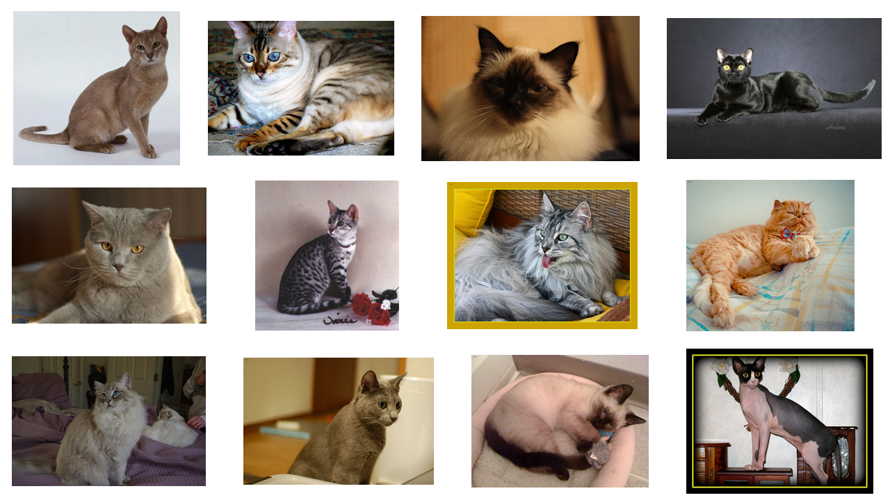

# Classification-12Cat-ResNet-and-ViT
# 一、项目介绍
本项目要求对十二种猫进行分类，属于计算机视觉领域的细粒度图像分类，又被称作子类别图像分类，目的是对属于同一基础类别的图像进行更加细致的子类划分，较之普通的图像分类任务，细粒度图像分类难度更大。仔细观察数据集不难发现，同一物种由于姿态、背景和拍摄角度不同，存在较大类内差异，肉眼可以区分的浅层视觉特征在于颜色、轮廓和纹理，卷积神经网络对于图像特征的区分具有强大的辨别能力，而细粒度图像的差异体现在细微之处，关键在于能否找到不同品种间具有区分性的区域块。

本项目旨在比较ResNet和Vision Transformer两种模型对于细粒度图像分类问题的性能表现。

# 二、数据集
本数据集在官方数据集的基础上，删除了（5 + 1）张脏图像，并Resize图像尺寸为[224, 224]。

| 名称 | 训练集和验证集 | 测试集 |  图像尺寸  |
| :--------: | :--------: | :--------: | :--------: |
| [官方数据集](https://aistudio.baidu.com/aistudio/datasetDetail/10954)   |  2160     | 240 |  任意尺寸都有  |
| [清洗数据集](https://aistudio.baidu.com/aistudio/datasetdetail/135339)  |  1724 + 431  | 239 | [224, 224] |

```
#目录结构
dataset/
├── cat_12_train
│   ├── 0aSixIFj9X73z41LMDUQ6ZykwnBA5YJW.jpg
│   ├── 0bBWRPd2t4NDIaO8567oyTgK3MU9rJZS.jpg
│   |   ...
├── cat_12_test
│   ├── mXIfNyVxBOZin4KQlYMdkPTSFA85ugrH.jpg
│   ├── zXyot03giwfhecLJlCm5NjQnY6VHq7Da.jpg
│   |   ...
|——train_list.txt
|——valid_list.txt
```



# 三、启动项目
## 3.1 解压数据集
下载数据集到本地，或在云端进行解压，注意数据集解压路径。
```
!unzip -oq data/data135339/cat12_dataset.zip -d ./
```

## 3.2 克隆PaddleClas
```
!git clone https://gitee.com/paddlepaddle/PaddleClas.git -b release/2.3
%cd PaddleClas/
!pip install --upgrade -r requirements.txt -i https://mirror.baidu.com/pypi/simple
%cd ../
```

## 3.3 修改配置文件
配置文件保存在config文件夹下
- config/ResNet152.yaml
- config/ViT_small_patch16_224.yaml

## 3.4 模型训练
`-c`指定配置文件路径，`-o`修改配置文件参数，加载预训练模型进行微调。
- ResNet模型训练
```
!python PaddleClas/tools/train.py  \
    -c config/ResNet152.yaml  \
    -o Arch.pretrained=True  \
```
- ViT模型训练
```
!python PaddleClas/tools/train.py  \
    -c config/ViT_small_patch16_224.yaml  \
    -o Arch.pretrained=True  \
```

## 3.5 模型评估
- ResNet模型评估结果：CELoss: 0.19398, loss: 0.19398, top1: 0.94664, top5: 1.00000
```
!python PaddleClas/tools/eval.py  \
    -c config/ResNet152.yaml  \
    -o Global.pretrained_model=output/ResNet152/best_model  \
```
- ViT模型评估结果：CELoss: 0.24738, loss: 0.24738, top1: 0.91183, top5: 1.00000
```
!python PaddleClas/tools/eval.py  \
    -c config/ViT_small_patch16_224.yaml  \
    -o Global.pretrained_model=output/ViT_small_patch16_224/best_model  \
```

## 3.6 模型预测
预测结果保存为CSV格式文件，替换`PaddleClas/ppcls/engine/engine.py`370行for循环代码，并在开头添加`import pandas as pd`。
- ResNet模型预测
```
!python PaddleClas/tools/infer.py  \
    -c config/ResNet152.yaml  \
    -o Infer.infer_imgs=dataset/cat_12_test  \
    -o Global.pretrained_model=output/ResNet152/best_model  \
```
- ViT模型预测
```
!python PaddleClas/tools/infer.py  \
    -c config/ViT_small_patch16_224.yaml  \
    -o Infer.infer_imgs=dataset/cat_12_test  \
    -o Global.pretrained_model=output/ViT_small_patch16_224/best_model  \
```


